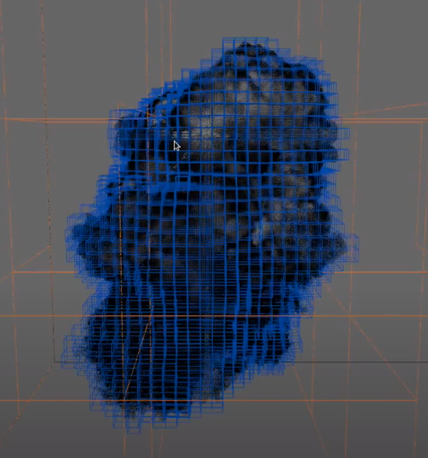

# Volume-ReSTIR
Vulkan implementation of Fast Volume Rendering with Spatiotemporal Reservoir Resampling.

* Zhihao Ruan (ruanzh@seas.upenn.edu), Shubham Sharma (sshubh@seas.upenn.edu), Raymond Yang (rayyang@seas.upenn.edu)
* Tested on: Windows 10 Home 21H1 Build 19043.1288, Ryzen 7 3700X @ 3.59GHz 48GB, RTX 2060 Super 8GB

**This project requires an RTX-compatible (Vulkan Ray Tracing KHR-compatible) graphics card to run.**

## Usage
### Building on Windows
This project relies on [Vcpkg](https://github.com/microsoft/vcpkg) to provide Windows support. Before building the code, one should make sure a working Vcpkg is installed in the system.

1. Install [OpenVDB](https://www.openvdb.org/) using Vcpkg:

```bash
vcpkg install openvdb --triplet=x64-windows
vcpkg integrate install
```

2. Create a build folder in the project directory.

```bash
mkdir build; cd build
```

3. Specify the root directory of Vcpkg in CMake configurations (default to be `C:\vcpkg`):

```bash
cmake .. -DVcpkg_ROOT=<PATH_TO_VCPKG>
```
If using CMake GUI, add a cache entry "Vcpkg_ROOT" of type `STRING` and type in the path to Vcpkg root folder.

4. On CMake GUI, Configure and generate the project.
5. Open Visual Studio 2019, select `volume_restir` project as startup project, and run the project.

### (Beta) Building on Linux (Ubuntu)
Before building, make sure that a working version of OpenVDB has been installed in the system.

```bash
mkdir build; cd build
cmake .. -DCMAKE_BUILD_TYPE=Release
make -j
./bin/volume_restir
```

## Highlights 
This project achieves the following:
* Vulkan ray tracing pipeline with [nvpro](https://github.com/nvpro-samples/nvpro_core).
* Volume assets loading and rendering through [OpenVDB](https://www.openvdb.org/).
* ReSTIR algorithm rendering on GLTF scene and volume assets.

## Introduction
ReSTIR has been a very successful fast path tracing-based rendering algorithm in recent computer graphics. However, the current state-of-the-art ReSTIR algorithm only works with meshes. Moreover, there exists some common objects in the scene that are not suitable for mesh creation. VDB asset is a special kind of asset that compensates the drawback of meshes and provides a much more accurate description for volume-based objects, such as smokes, clouds, fire flames, etc. 

### VDB Data Structures
VDB is a special type of data structure for smokes, clouds, fire flames, etc. that is based on hierarchical voxel grids. It essentially holds a set of particles. It also uses a similar tree-like data structure as scene graphs for fast traversal and access that stores all transformations at intermediate nodes, and only the particle positions at leaf nodes.




## Pitch
- [Project Pitch](https://github.com/TheSmokeyGuys/Volume-ReSTIR-Vulkan/blob/task/updateReadme/docs/finalProjectPitch.pdf)

## Milestone 1 (11/17/2021)
- [Milestone 1 Presentation](https://github.com/TheSmokeyGuys/Volume-ReSTIR-Vulkan/blob/task/updateReadme/docs/milestone1.pdf)
By milestone 1, we have set up a basic Vulkan rendering pipeline using [vk-bootstrap](https://github.com/charles-lunarg/vk-bootstrap).

## Milestone 2 (11/29/2021)
- [Milestone 2 Presentation](https://github.com/TheSmokeyGuys/Volume-ReSTIR-Vulkan/blob/task/updateReadme/docs/milestone2.pdf)
By milestone 2, we have set up general 3D rendering in Vulkan and volume rasterization with [OpenVDB](https://www.openvdb.org/) 

## Milestone 3 (12/06/2021)
- [Milestone 3 Presentation](https://github.com/TheSmokeyGuys/Volume-ReSTIR-Vulkan/blob/task/updateReadme/docs/milestone3.pdf)
By milestone 3, we have set up a pipeline for path tracing volumetric data and a separate pipeline for ReSTIR on triangle mesh 3D data. 

<p align="center">

</p>

<p align="center">

</p>

<p align="center">

</p>

<p align="center">

</p>


## References
1. Daqi Lin, Chris Wyman, Cem Yuksel. [Fast Volume Rendering with Spatiotemporal Reservoir Resampling](https://research.nvidia.com/publication/2021-11_Fast-Volume-Rendering). ACM Transactions on Graphics (Proceedings of SIGGRAPH Asia 2021), 40, 6, 2021.
2. [OpenVDB](https://www.openvdb.org/) for VDB data loading.
3. [nvpro](https://github.com/nvpro-samples/nvpro_core) for Vulkan Ray Tracing KHR setup.
4. [spdlog](https://github.com/gabime/spdlog) for fast C++ logging.
5. Common graphics utilities [glfw](https://github.com/glfw/glfw), [glm](https://github.com/g-truc/glm), [stb](https://github.com/nothings/stb). These are all included in the [nvpro](https://github.com/nvpro-samples/nvpro_core).
